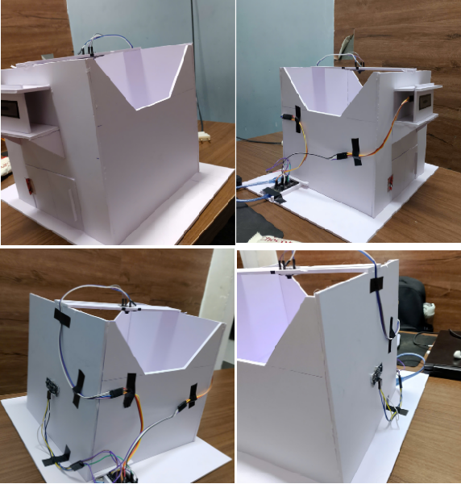

# ♻️ Smart Trash Classification System

This project is a web-based trash classification system that allows users to upload images of trash (via web interface or ESP32-CAM) and receive predictions powered by Convolutional Neural Networks (CNN). It supports account registration/login, user profile management, prediction statistics, and an admin dashboard for monitoring usage.

## 📌 Features

- 🧠 CNN-powered trash classification with confidence score
- 🧾 User registration, login, and profile management
- 📊 Admin dashboard to manage users and reset trash statistics
- 🌐 Web interface for image uploads
- 📡 ESP32-CAM integration for IoT use cases

## 🛠️ Tech Stack

- **Backend:** Flask, SQLAlchemy, SQLite
- **Frontend:** Jinja2 Templates
- **Model:** CNN-based image classifier (`inceptionv3.ipynb`, `CNN_model1.ipynb`)
- **Authentication:** Session-based
- **Database:** SQLite
- **IoT:** ESP32-CAM → Flask API → Prediction → ESP8266 Response

## 📂 Project Structure

```
.
├── TrashFlask/
│   ├── app.py              # Main Flask application
│   ├── forms.py            # WTForms definitions
│   ├── helper.py           # Utility functions (file handling, formatting)
│   ├── predict.py          # Image preprocessing and prediction logic
│   ├── flaskApp.sqlite     # SQLite database
│   ├── templates/          # HTML templates for UI
│   ├── captured_images/    # Uploaded or camera-captured images
│   └── __pycache__/        # Compiled Python files
│
├── CNN_model1.ipynb        # Training a custom CNN model
├── inceptionv3.ipynb       # Transfer learning with InceptionV3
├── file_process.ipynb      # Data preprocessing and augmentation
├── README.md               # Project overview
└── requirements.txt        # Python dependencies
```

## 📷 Prototype



## 🚀 Getting Started

### 1. Clone the Repository

```bash
git clone https://github.com/Lmonzz/trash-classification.git
cd trash-classification
```

### 2. Create Virtual Environment & Install Dependencies

```bash
python -m venv venv
source venv/bin/activate  # On Windows use: venv\Scripts\activate
pip install -r requirements.txt
```

### 3. Run the Application

```bash
python app.py
```

Then navigate to `http://localhost:5000/` in your browser.

## 📷 ESP32-CAM Integration

ESP32 sends an image to `/upload_img_esp`, and Flask responds with a JSON prediction. The system also forwards the result to an ESP8266 microcontroller.

Example response:
```json
{
  "result": "plastic",
  "confidence": 0.89
}
```

## 🧪 Model Training

You can retrain the trash classifier using the Jupyter notebooks provided:

- `CNN_model1.ipynb`
- `inceptionv3.ipynb`

Ensure your dataset is properly structured and paths are correctly set in the notebook.

## 👤 Roles

- **User:** Upload trash images, view classification results, update profile
- **Admin:** Manage users, view trash statistics, reset data

## 🔒 Security Note

- The current implementation uses session-based authentication.
- Passwords are hashed using `werkzeug.security`.

## ✅ To-Do

- Improve frontend UI/UX
- Add email verification
- Deploy on cloud (e.g., Heroku, AWS)
- Replace SQLite with PostgreSQL or MySQL for production

